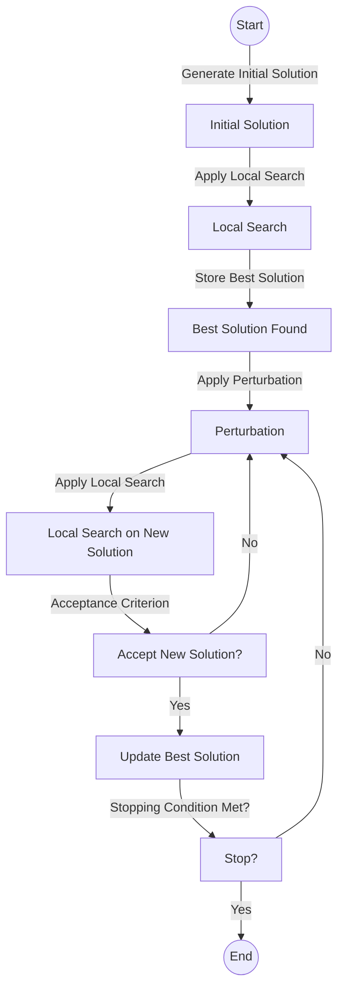
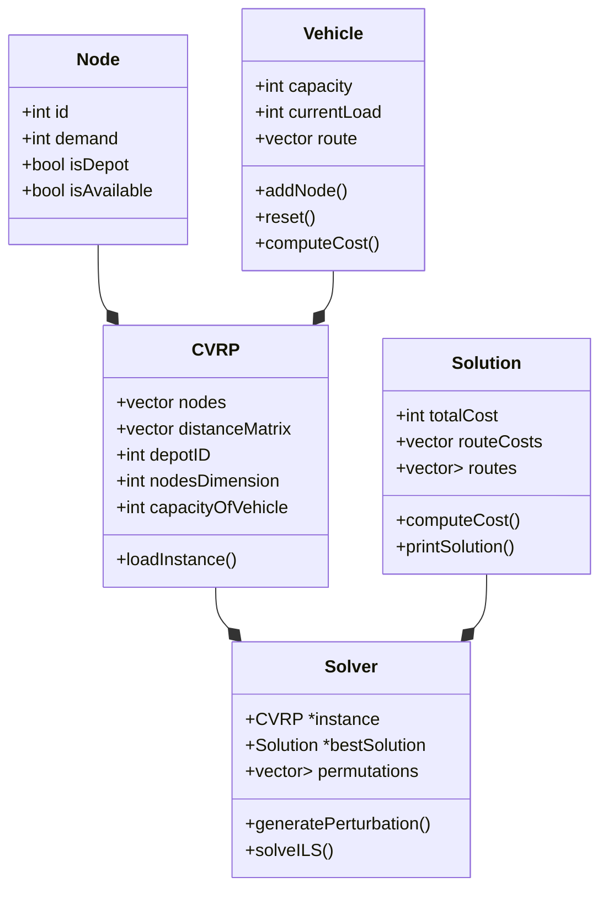
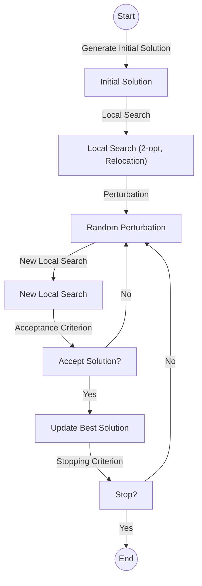
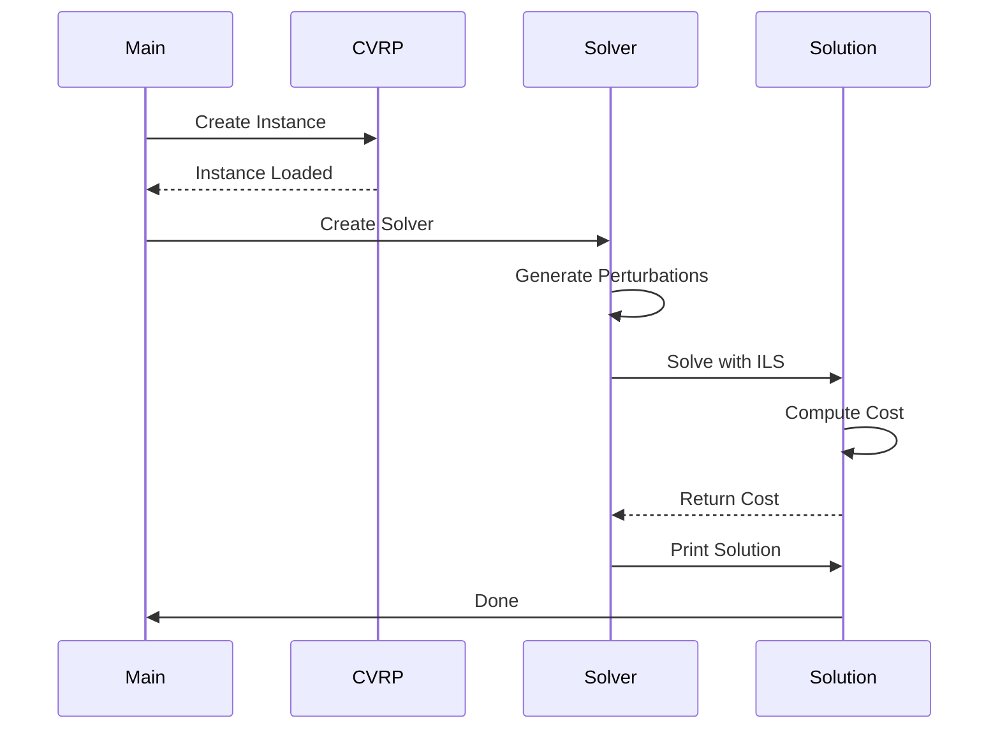
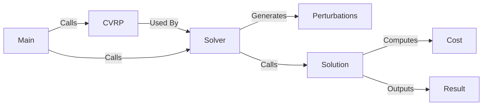

# 🚛 Capacitated Vehicle Routing Problem (CVRP)
# 🚩 A Iterated Local Search (ILS) Approach

This repository contains an implementation of the **Iterated Local Search (ILS)** algorithm to solve the **Capacitated Vehicle Routing Problem (CVRP)**.
CVRP is a classic optimization problem that aims to determine the most efficient routes for a fleet of vehicles 🚐, considering their limited capacity and customer demands 📦.

## ✨ Features
- 🔄 **Iterated Local Search (ILS)**: A metaheuristic for efficiently finding good solutions.
- ⚡ **Enhanced Local Search**: Uses heuristics like 2-opt and Relocation to optimize routes.
- 🔧 **Configurable Parameters**: Adjust perturbation intensity and acceptance criteria.
- 📊 **Results Visualization**: Graphs and statistics for performance analysis.

## 🚀 Use Cases
This repository is ideal for:
- 📚 Studying and understanding CVRP and ILS.
- 🏎️ Solving medium-sized problem instances efficiently.
- 📊 Comparing ILS with other metaheuristics like Simulated Annealing and Genetic Algorithms.

## 🏗 Project Structure
```
CapacitatedVehicleRoutingProblem-ILS/
│── Benchmarks/    # Test instances
│── src/           # Algorithm source code
│── results/       # Results and analysis
│── Makefile       # Automated compilation
│── README.md      # Documentation
```

## 🛠️ Compilation and Execution
The project uses a `Makefile` for easy compilation. To build the project, run:
```
make
```
This will generate an executable. To run the program, use:
```
./cvrp_solver input_file.vrp
```
Where `input_file.vrp` is a valid problem instance located in the `Benchmarks/` directory.

## 📌 Example Usage
```
./bin/cvrp_solver Benchmarks/T/T-n5-k5.vrp Output/T/T-n5-k5.sol
./bin/cvrp_solver Benchmarks/A/A-n32-k5.vrp Output/A/A-n32-k5.sol
```
## 🐉 Valgrind Example Usage
```
valgrind --leak-check=yes -s ./bin/cvrp_solver Benchmarks/T/T-n5-k5.vrp Output/T/T-n5-k5.sol
valgrind --leak-check=yes -s ./bin/cvrp_solver Benchmarks/A/A-n32-k5.vrp Output/A/A-n32-k5.sol
```


This command processes the problem instance and outputs the solution found by the ILS algorithm.

## 🎡 General framework
1. Generate Initial Solution → Create a feasible starting solution.
2. Local Search → Apply heuristics like 2-opt or Swap to improve the solution.
3. Store Best Solution → Save the best solution found so far.
4. Perturbation → Modify the solution to escape local optima.
5. Local Search on Perturbed Solution → Optimize the perturbed solution.
6. Acceptance Criterion → Decide whether to accept the new solution.
7. Stopping Condition → If met, the process ends; otherwise, the algorithm iterates again.



## 📊 Class Diagram Overview



## 🔀 Activity Diagram

### 📋 Main Steps
1. **Initial Solution Generation**: Uses constructive heuristics like Nearest Neighbor.
2. **Local Search**: Applies optimizations such as 2-opt and Relocation.
3. **Perturbation**: Modifies the current solution to escape local optima.
4. **Acceptance Criterion**: Decides whether to accept the new solution.
5. **Iteration**: Repeats until a stopping criterion is met.



## ➡️ Sequence Diagram


## ↔️ Communication Diagram


---

## 📊 Results Analysis
The repository includes scripts to visualize and analyze the performance of the obtained solutions, allowing comparison of different parameters and perturbation strategies.

## 🎯 Contributions
Contributions are welcome! If you want to improve the algorithm or add new heuristics, feel free to open a **Pull Request**.

---
Feel free to explore, experiment, and optimize! 🛠️

