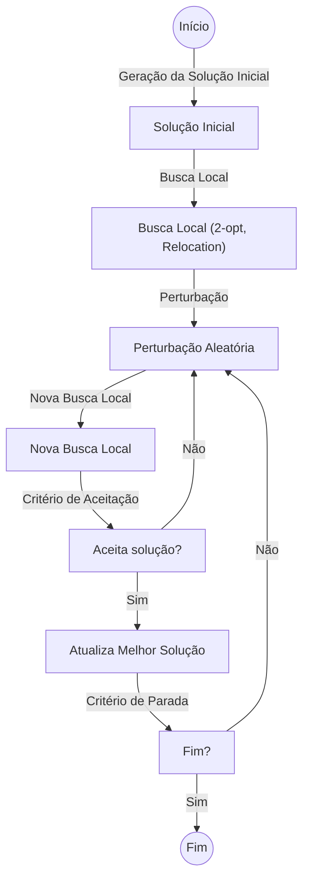

# 🚛 Capacitated Vehicle Routing Problem (CVRP) - Iterated Local Search (ILS)

Este repositório contém uma implementação do algoritmo **Iterated Local Search (ILS)** para resolver o **Capacitated Vehicle Routing Problem (CVRP)**.
O CVRP é um problema clássico de otimização que busca determinar as rotas mais eficientes para uma frota de veículos 🚐, levando em conta a capacidade limitada dos mesmos e as demandas dos clientes 📦.

## ✨ Características
- 🔄 **Iterated Local Search (ILS)**: Metaheurística eficiente para encontrar boas soluções em tempo hábil.
- ⚡ **Busca Local Aprimorada**: Utiliza heurísticas como 2-opt e Relocation para otimizar as rotas.
- 🔧 **Parâmetros Configuráveis**: Ajuste a intensidade das perturbações e critérios de aceitação.
- 📊 **Visualização de Resultados**: Gráficos e estatísticas para análise de desempenho.

## 🚀 Casos de Uso
Este repositório é ideal para:
- 📚 Estudo e compreensão do CVRP e do ILS.
- 🏎️ Resolução eficiente de instâncias de médio porte.
- 📊 Comparar ILS com outras metaheurísticas como Simulated Annealing e Genetic Algorithms.

## 🏗 Estrutura do Projeto
```
CapacitatedVehicleRoutingProblem-ILS/
│── Benchmarks/    # Instâncias de teste
│── src/           # Código-fonte do algoritmo
│── results/       # Resultados e análises
│── Makefile       # Compilação automatizada
│── README.md      # Documentação
```

## 🛠️ Compilação e Execução
O projeto utiliza um `Makefile` para facilitar a compilação. Para construir o projeto, execute:
```
make
```
Isso gerará um executável. Para executar o programa, use:
```
./cvrp_solver_ils input_file.vrp
```
Onde `input_file.vrp` é uma instância válida do problema contida no diretório `Benchmarks/`.

## 📌 Exemplo de Uso
```
./bin/cvrp_solver_ils Benchmarks/T/T-n5-k5.vrp Output/T/T-n5-k5.sol
```
Este comando processa a instância do problema e gera a solução encontrada pelo algoritmo ILS.

## 🔀 Algoritmo Iterated Local Search (ILS)

### 📋 Etapas Principais
1. **Geração da Solução Inicial**: Utiliza heurísticas construtivas como Nearest Neighbor.
2. **Busca Local**: Aplica-se otimizações como 2-opt e Relocation.
3. **Perturbação**: Modifica a solução atual para escapar de ótimos locais.
4. **Critério de Aceitação**: Define se a nova solução substitui a anterior.
5. **Iteração**: Repete os passos até atingir um critério de parada.

### 🔄 Diagrama do Fluxo do Algoritmo


## 📊 Análise de Resultados
O repositório inclui scripts para visualizar e analisar o desempenho das soluções obtidas, permitindo comparar diferentes parâmetros e perturbações.

## 🎯 Contribuições
Contribuições são bem-vindas! Se quiser melhorar o algoritmo ou adicionar novas heurísticas, fique à vontade para abrir um **Pull Request**.

---
Sinta-se livre para explorar, experimentar e otimizar! 🛠️

