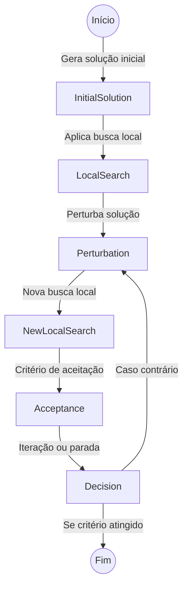

# 🔄 Iterated Local Search (ILS)

Este repositório contém uma implementação do algoritmo **Iterated Local Search (ILS)**, uma meta-heurística eficiente para resolver problemas de otimização combinatória. O ILS utiliza buscas locais repetitivas, intercaladas com perturbações controladas, permitindo escapar de mínimos locais e explorar o espaço de soluções de maneira mais eficaz.

## ✨ Recursos
- 🔍 **Busca Local**: Refina soluções através de heurísticas otimizadas.
- 🔄 **Perturbação Inteligente**: Introduz modificações estruturadas para evitar estagnação.
- 📈 **Critério de Aceitação**: Define quando uma solução perturbada deve ser aceita.
- 🏗 **Fácil Customização**: Parâmetros ajustáveis para diferentes aplicações.

## 🚀 Casos de Uso
O ILS é amplamente utilizado em problemas como:
- 🚚 **Roteamento de Veículos** (VRP)
- 📅 **Escalonamento de Tarefas**
- 📍 **Otimização de Redes**
- 📦 **Problema da Mochila e Variações**

## 🏗 Estrutura do Projeto
```
ILS-Algorithm/
│── Benchmarks/    # Casos de teste e benchmarks
│── src/           # Implementação do algoritmo
│── Makefile       # Compilação automática
│── README.md      # Documentação do projeto
```

## ⚙️ Execução
Para compilar o projeto, use:
```
make
```
Para executar o algoritmo em uma instância de problema:
```
./ils_solver input_file.txt
```

## 📌 Exemplo de Uso
```
./bin/ils_solver Benchmarks/problem_1.txt Output/problem_1.sol
```

## 📊 Fluxo do Algoritmo


## 📝 Notas
- O algoritmo pode ser ajustado para diferentes problemas através da escolha da busca local e do método de perturbação.
- Benchmarks estão disponíveis para teste e comparação de desempenho.

Sinta-se à vontade para explorar e contribuir! 🚀

