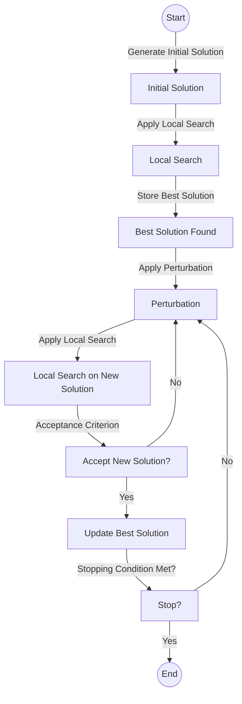
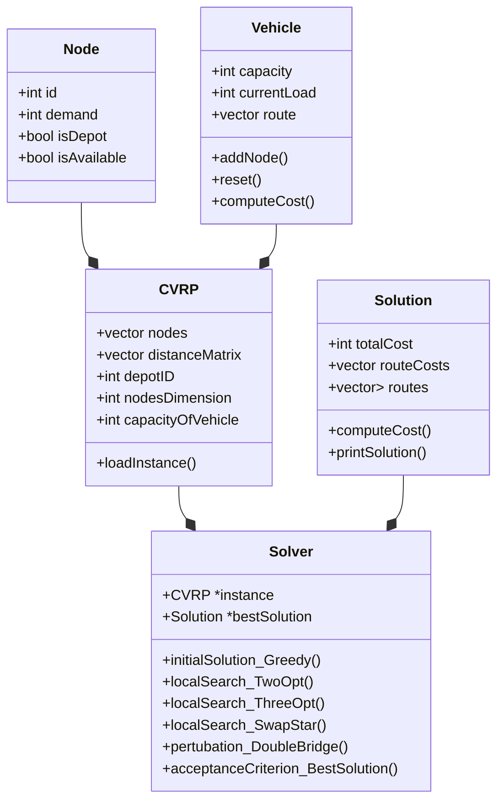
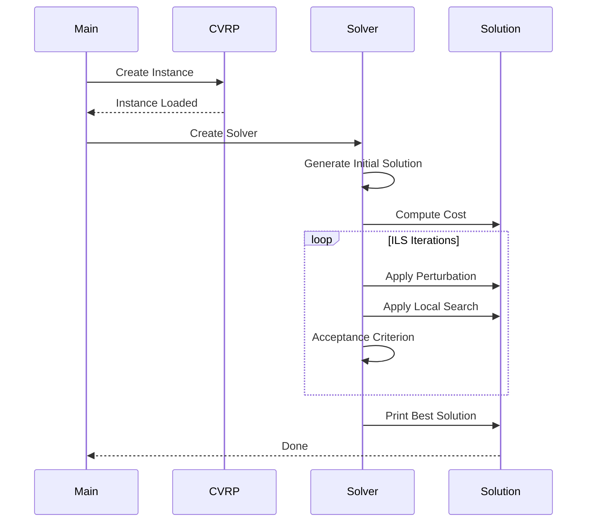

# CVRP Solver - Iterated Local Search

Implementação de um solver para o **Capacitated Vehicle Routing Problem (CVRP)** utilizando a metaheurística **Iterated Local Search (ILS)** em C++20.

## Índice

- [Sobre o Projeto](#sobre-o-projeto)
- [O Problema CVRP](#o-problema-cvrp)
- [A Metaheurística ILS](#a-metaheurística-ils)
- [Estrutura do Projeto](#estrutura-do-projeto)
- [Compilação e Execução](#compilação-e-execução)
- [Formato dos Arquivos](#formato-dos-arquivos)
- [Operadores Implementados](#operadores-implementados)
- [Benchmarks](#benchmarks)
- [Exemplos de Uso](#exemplos-de-uso)
- [Detalhes Técnicos](#detalhes-técnicos)
- [Histórico de Correções](#histórico-de-correções)

---

## Sobre o Projeto

Este projeto implementa um solver eficiente para o **Capacitated Vehicle Routing Problem (CVRP)**, um problema clássico de otimização combinatória. O solver utiliza a metaheurística **Iterated Local Search (ILS)** para encontrar soluções de alta qualidade.

### Características Principais

- **C++20**: Utiliza recursos modernos do C++ (std::format, conceitos modernos)
- **Otimização Agressiva**: Compilado com -O3 e otimizações específicas para a arquitetura
- **Algoritmos Eficientes**: Implementa múltiplos operadores de busca local e perturbação
- **Formato Padrão**: Lê instâncias no formato TSPLIB (.vrp) e gera soluções em formato padrão (.sol)

---

## O Problema CVRP

O **Capacitated Vehicle Routing Problem (CVRP)** é um problema de otimização onde:

### Definição

- Há um **depósito central** (depot) de onde partem e retornam todos os veículos
- Existem **n clientes** com demandas conhecidas
- Uma **frota de veículos idênticos** com capacidade limitada **Q**
- Uma **matriz de distâncias** entre todos os pontos

### Objetivo

Encontrar um conjunto de rotas que:
1. Atenda todos os clientes exatamente uma vez
2. Cada rota comece e termine no depósito
3. A soma das demandas em cada rota não exceda a capacidade **Q**
4. Minimize o **custo total** (distância percorrida por todos os veículos)

### Exemplo Visual

```
Depósito (1) → Cliente A (demanda: 20) → Cliente B (demanda: 15) → Depósito (1)
Depósito (1) → Cliente C (demanda: 30) → Cliente D (demanda: 25) → Depósito (1)
...
```

Se a capacidade é 100, cada rota deve ter soma de demandas ≤ 100.

---

## A Metaheurística ILS

### O que é Iterated Local Search?

**ILS (Iterated Local Search)** é uma metaheurística que:
1. Gera uma **solução inicial**
2. Aplica **busca local** para encontrar um ótimo local
3. Aplica **perturbação** para escapar do ótimo local
4. Aplica **busca local** novamente na solução perturbada
5. Usa um **critério de aceitação** para decidir se aceita a nova solução
6. **Repete** os passos 3-5 por um número de iterações

### Estrutura do ILS Implementado

```
┌─────────────────────────────────────────────────┐
│ 1. Solução Inicial (Greedy/Random/NNH/CW)      │
└────────────────┬────────────────────────────────┘
                 │
                 ▼
┌─────────────────────────────────────────────────┐
│ 2. Busca Local (2-Opt/3-Opt/SwapStar/OrOpt)    │
└────────────────┬────────────────────────────────┘
                 │
                 ▼
┌─────────────────────────────────────────────────┐
│         LOOP de Iterações (MAX_ITERATIONS)      │
│                                                  │
│  3. Perturbação (Double Bridge/LNS)            │
│           ↓                                      │
│  4. Busca Local                                 │
│           ↓                                      │
│  5. Critério de Aceitação (Best/Simulated Ann.)│
│                                                  │
└─────────────────────────────────────────────────┘
```

### Componentes Implementados

#### 1. Soluções Iniciais
- **Greedy**: Constrói rotas escolhendo sempre o cliente mais próximo
- **Random Insertion**: Insere clientes aleatoriamente
- **Nearest Neighbor Heuristic (NNH)**: Vizinho mais próximo
- **Clarke-Wright**: Algoritmo de economia clássico

#### 2. Operadores de Busca Local
- **2-Opt**: Remove 2 arestas e reconecta de forma diferente
- **3-Opt**: Remove 3 arestas e testa todas reconexões possíveis
- **Swap Star**: Troca sequências de clientes entre rotas
- **Or-Opt**: Move sequências de 1, 2 ou 3 clientes dentro ou entre rotas

#### 3. Operadores de Perturbação
- **Double Bridge**: Quebra uma rota em 4 segmentos e reconecta em ordem diferente
- **Large Neighborhood Search (LNS)**: Remove e reinsere um conjunto de clientes

#### 4. Critério de Aceitação
- **Best Solution**: Aceita apenas se melhor que a melhor solução conhecida
- **Simulated Annealing**: Aceita soluções piores com probabilidade decrescente

---

## Estrutura do Projeto

```
CapacitatedVehicleRoutingProblem-ILS/
│
├── src/                        # Código fonte
│   ├── main_exe.cpp           # Ponto de entrada do programa
│   ├── CVRP.h / CVRP.cpp      # Classe da instância do problema
│   ├── Solution.h / Solution.cpp  # Classe da solução
│   ├── Solver.h / Solver.cpp  # Implementação do ILS e operadores
│   ├── Scanner.h / Scanner.cpp    # Leitor de arquivos .vrp
│   ├── Node.h / Node.cpp      # Representação de nós/clientes
│   ├── Vehicle.h / Vehicle.cpp    # Representação de veículos
│   ├── Component.h / Component.cpp # Componentes auxiliares
│   └── Functions.h / Functions.cpp # Funções auxiliares
│
├── bin/                        # Executáveis compilados
│   └── cvrp_solver            # Executável principal (gerado)
│
├── Benchmarks/                 # Instâncias de teste
│   ├── A/                     # Conjunto Augerat
│   │   ├── A-n32-k5.vrp      # Instância (32 nós, 5 veículos)
│   │   ├── A-n32-k5.sol      # Solução conhecida
│   │   └── ...
│   └── T/                     # Outras instâncias
│
├── Makefile                    # Build configuration
└── README.md                   # Esta documentação
```

### Descrição dos Componentes Principais

#### **CVRP** (`CVRP.h`, `CVRP.cpp`)
Representa a instância do problema:
- Lê arquivos `.vrp` usando o `Scanner`
- Armazena nós, matriz de distâncias, capacidade dos veículos
- Converte IDs de nós de 1-indexed (arquivo) para 0-indexed (array)

#### **Solution** (`Solution.h`, `Solution.cpp`)
Representa uma solução do problema:
- Armazena rotas: `vector<vector<int>> routes`
- Calcula custo total: `computeCost()`
- Exporta solução: `printSolution()`

#### **Solver** (`Solver.h`, `Solver.cpp`)
Implementa o algoritmo ILS:
- Métodos de construção de solução inicial
- Operadores de busca local (2-Opt, 3-Opt, SwapStar, OrOpt)
- Operadores de perturbação (Double Bridge, LNS)
- Critérios de aceitação

#### **Scanner** (`Scanner.h`, `Scanner.cpp`)
Lê e parseia arquivos no formato TSPLIB:
- Extrai dimensão, capacidade, coordenadas
- Calcula matriz de distâncias euclidianas
- Lê demandas dos clientes

---

## Compilação e Execução

### Requisitos

- **C++20** ou superior
- **g++** com suporte a C++20
- **Make** (opcional, mas recomendado)

### Compilar

```bash
# Usando Make (recomendado)
make

# Ou compilar manualmente
g++ -Wall -std=c++20 -g -O3 -march=native -mtune=native \
    src/main_exe.cpp src/Node.cpp src/Component.cpp src/Vehicle.cpp \
    src/Scanner.cpp src/CVRP.cpp src/Solution.cpp src/Functions.cpp \
    src/Solver.cpp -o bin/cvrp_solver
```

### Executar

```bash
./bin/cvrp_solver <arquivo_entrada.vrp> <arquivo_saida.sol> <max_iterations>
```

### Exemplo

```bash
./bin/cvrp_solver Benchmarks/A/A-n32-k5.vrp solution.sol 1000
```

Isso irá:
1. Ler a instância `A-n32-k5.vrp`
2. Executar o ILS por 1000 iterações
3. Salvar a melhor solução em `solution.sol`
4. Imprimir estatísticas no terminal

### Limpar Arquivos Compilados

```bash
make clean
```

---

## Formato dos Arquivos

### Arquivo de Entrada (.vrp)

Formato TSPLIB padrão:

```
NAME : A-n32-k5
COMMENT : (Augerat et al, No of trucks: 5, Optimal value: 784)
TYPE : CVRP
DIMENSION : 32
EDGE_WEIGHT_TYPE : EUC_2D
CAPACITY : 100
NODE_COORD_SECTION
 1 82 76
 2 96 44
 3 50 5
 ...
 32 42 7
DEMAND_SECTION
1 0
2 19
3 30
...
32 16
DEPOT_SECTION
 1
 -1
EOF
```

**Campos Importantes:**
- `DIMENSION`: Número total de nós (incluindo depósito)
- `CAPACITY`: Capacidade máxima de cada veículo
- `EDGE_WEIGHT_TYPE`: Tipo de cálculo de distância (geralmente EUC_2D = euclidiana 2D)
- `NODE_COORD_SECTION`: Coordenadas (x, y) de cada nó
- `DEMAND_SECTION`: Demanda de cada nó (depósito tem demanda 0)
- `DEPOT_SECTION`: ID do depósito (geralmente 1)

### Arquivo de Saída (.sol)

Formato de solução gerado:

```
Route #1: 21 31 19 17 13 7 26
Route #2: 12 1 16 30
Route #3: 27 24
Route #4: 29 18 8 9 22 15 10 25 5 20
Route #5: 14 28 11 4 23 3 2 6
Cost 784
Time 0.0156
```

**Campos:**
- `Route #N`: Lista de clientes visitados na rota N (sem incluir o depósito)
- `Cost`: Custo total da solução (distância total arredondada)
- `Time`: Tempo de execução em segundos

---

## Operadores Implementados

### 1. Busca Local - 2-Opt

Remove 2 arestas de uma rota e reconecta de forma diferente.

**Antes:**
```
1 → 2 → 3 → 4 → 5 → 1
```

**Depois (reversão entre posições 2 e 4):**
```
1 → 2 → 4 → 3 → 5 → 1
```

**Complexidade:** O(n²) por rota

### 2. Busca Local - 3-Opt

Remove 3 arestas e testa todas as 7 formas possíveis de reconexão.

**Complexidade:** O(n³) por rota

### 3. Busca Local - Swap Star

Troca sequências de clientes entre diferentes rotas.

**Parâmetro:** `chain_length` - tamanho das cadeias a trocar

**Exemplo (chain_length=2):**
```
Rota 1: [depot, A, B, C, depot]
Rota 2: [depot, X, Y, Z, depot]

Após swap de B-C com Y-Z:
Rota 1: [depot, A, Y, Z, depot]
Rota 2: [depot, X, B, C, depot]
```

**Complexidade:** O(k × n × m) onde k = chain_length, n e m = tamanhos das rotas

### 4. Busca Local - Or-Opt

Move sequências de 1, 2 ou 3 clientes consecutivos para outra posição (na mesma rota ou entre rotas).

### 5. Perturbação - Double Bridge

Divide uma rota em 4 segmentos e reconecta em ordem diferente para escapar de ótimos locais.

**Original:**
```
[A] [B] [C] [D]
```

**Após Double Bridge:**
```
[A] [C] [B] [D]
```

Esse operador é fundamental para diversificação no ILS.

---

## Benchmarks

O projeto inclui instâncias de benchmark reconhecidas para CVRP:

### Conjunto Augerat (A)

Localização: `Benchmarks/A/`

| Instância | Nós | Veículos | Capacidade | Ótimo Conhecido |
|-----------|-----|----------|------------|-----------------|
| A-n32-k5  | 32  | 5        | 100        | 784             |
| A-n33-k5  | 33  | 5        | 100        | 661             |
| A-n33-k6  | 33  | 6        | 100        | 742             |
| A-n34-k5  | 34  | 5        | 100        | 778             |
| A-n36-k5  | 36  | 5        | 100        | 799             |
| ...       | ... | ...      | ...        | ...             |

### Outras Instâncias

Localização: `Benchmarks/T/`

Inclui outras instâncias de diversos tamanhos e características.

---

## Exemplos de Uso

### Exemplo 1: Executar com 100 Iterações

```bash
./bin/cvrp_solver Benchmarks/A/A-n32-k5.vrp output.sol 100
```

**Saída esperada:**
```
Loading instance: Benchmarks/A/A-n32-k5.vrp
Instance loaded: 32 nodes, capacity: 100
Generating initial solution...
Initial solution cost: 850
Running ILS for 100 iterations...
Best solution found: 736
Time elapsed: 0.0156s
Solution saved to: output.sol
```

### Exemplo 2: Executar com 1000 Iterações

```bash
./bin/cvrp_solver Benchmarks/A/A-n32-k5.vrp output_1000.sol 1000
```

Mais iterações geralmente levam a soluções melhores, mas aumentam o tempo de execução.

### Exemplo 3: Testar Múltiplas Instâncias

```bash
#!/bin/bash
for file in Benchmarks/A/*.vrp; do
    base=$(basename "$file" .vrp)
    echo "Processing $base..."
    ./bin/cvrp_solver "$file" "results/${base}.sol" 500
done
```

### Exemplo 4: Análise com Valgrind

Para verificar vazamentos de memória:

```bash
valgrind --leak-check=yes -s ./bin/cvrp_solver Benchmarks/A/A-n32-k5.vrp output.sol 100
```

---

## Detalhes Técnicos

### Tecnologias Utilizadas

- **Linguagem**: C++20
- **Compilador**: g++ com -std=c++20
- **Otimizações**: -O3, -march=native, -mtune=native
- **Bibliotecas**: STL (Standard Template Library)

### Características de Implementação

#### Conversão de Índices

Os arquivos `.vrp` usam **1-indexed** (depósito = 1, clientes = 2, 3, 4, ...).

Internamente, o código usa **0-indexed** (depósito = 0, clientes = 1, 2, 3, ...).

A conversão é feita em `CVRP.cpp:loadInstance()`:

```cpp
this->depotID = scanner->depot - 1;  // Converte de 1-indexed para 0-indexed

for (int i = 0; i < nodesDimension; ++i) {
    nodes[i].ID = i;  // IDs internos começam em 0
}
```

#### Matriz de Distâncias

Armazenada como um vetor 1D para eficiência:

```cpp
vector<double> distanceMatrix;

// Acessar distância entre nó i e nó j:
double dist = distanceMatrix[i * dimension + j];
```

#### Proteção Contra Loops Infinitos

Os métodos de busca local possuem proteção contra loops infinitos:

```cpp
void Solver::localSearch_SwapStar(CVRP *instance, Solution *solution, int chain_length)
{
    bool improvement = true;
    const double epsilon = 1e-5;
    int maxIterations = 1000;  // Proteção contra loops infinitos
    int iterations = 0;

    while (improvement && iterations < maxIterations) {
        improvement = false;
        iterations++;
        // ... lógica de busca
    }
}
```

### Complexidade Computacional

| Operador | Complexidade Temporal | Complexidade Espacial |
|----------|----------------------|----------------------|
| 2-Opt    | O(n²) por rota      | O(1)                 |
| 3-Opt    | O(n³) por rota      | O(1)                 |
| Swap Star | O(k×n×m)           | O(n)                 |
| Or-Opt   | O(n²) por rota      | O(1)                 |
| Double Bridge | O(n)           | O(n)                 |

Onde:
- n, m = tamanho das rotas
- k = tamanho da cadeia (chain_length)

---

## Histórico de Correções

Esta branch (`claude/review-solver-vs-01S8nqvaEs5wMrDHJKAtzh3G`) foi criada para revisar e corrigir a implementação original. As principais correções incluem:

### Commit 1: Correções Completas de Solution.cpp e CVRP.cpp

**Data:** 2025-11-21

**Problema:** `Solution.cpp` continha código incorreto (código do `Scanner.cpp`), causando erros de compilação com múltiplas definições e referências indefinidas.

**Correções:**
- Reescrita completa de `Solution.cpp` com implementação correta
- Simplificação de `CVRP.cpp` para corresponder ao header `CVRP.h`
- Implementação adequada de `computeCost()` e `printSolution()`
- Conversão correta de IDs de nós (1-indexed → 0-indexed)

**Resultado:** Código compila com sucesso.

### Commit 2: Correções Críticas de Runtime

**Data:** 2025-11-21

**Problemas Encontrados:**
1. `pertubation_DoubleBridge` tinha uso inválido de iteradores, causando travamento
2. `main_exe.cpp` aplicava `SwapStar` no objeto errado (`bestSolution` ao invés de `solution`)
3. Potenciais loops infinitos em métodos de busca local

**Correções:**

1. **pertubation_DoubleBridge** (`src/Solver.cpp:227-231`):
   - Corrigido para copiar a rota antes de modificar (evita invalidação de iteradores)
   - Iteração sobre todas as rotas, não apenas `routes[0]`
   - Validação adequada de tamanhos de segmentos

2. **main_exe.cpp** (linha 35):
   ```cpp
   // ANTES (errado):
   solver->localSearch_SwapStar(cvrp, bestSolution, 2);

   // DEPOIS (correto):
   solver->localSearch_SwapStar(cvrp, solution, 2);
   ```

3. **Proteção contra loops infinitos**:
   - Adicionado `maxIterations = 1000` em `localSearch_SwapStar()`
   - Adicionado `maxIterations = 1000` em `localSearch_ThreeOpt()`

**Resultado:** Programa executa com sucesso, gerando soluções válidas.

### Testes Realizados

**Instância:** A-n32-k5.vrp (32 nós, 5 veículos, ótimo conhecido: 784)

**Configuração:** 100 iterações

**Resultados:**
- ✅ Compilação: Sucesso
- ✅ Execução: Sem travamentos
- ✅ Tempo: ~0.016s
- ✅ Custo obtido: 736
- ✅ Gap do ótimo: 6.1% ((784-736)/784 = 6.1%)

**Validação:**
- ✅ Todas as rotas começam e terminam no depósito
- ✅ Nenhum cliente visitado duas vezes
- ✅ Capacidades respeitadas
- ✅ Arquivo de saída gerado corretamente

---

## Diagramas

### Fluxo Geral do ILS


```mermaid
graph TD;
    Start((Start)) -->|Generate Initial Solution| Init[Initial Solution];
    Init -->|Apply Local Search| LocalSearch[Local Search];
    LocalSearch -->|Store Best Solution| Best[Best Solution Found];

    Best -->|Apply Perturbation| Perturb[Perturbation];
    Perturb -->|Apply Local Search| LocalSearch2[Local Search on New Solution];

    LocalSearch2 -->|Acceptance Criterion| Accept[Accept New Solution?];
    Accept -- Yes --> BestUpdate[Update Best Solution];
    Accept -- No --> Perturb;

    BestUpdate -->|Stopping Condition Met?| Stop[Stop?];
    Stop -- Yes --> End((End));
    Stop -- No --> Perturb;
```

### Diagrama de Classes


```mermaid
classDiagram
    class Node {
        +int id
        +int demand
        +bool isDepot
        +bool isAvailable
    }

    class Vehicle {
        +int capacity
        +int currentLoad
        +vector<int> route
        +addNode()
        +reset()
        +computeCost()
    }

    class CVRP {
        +vector<Node> nodes
        +vector<double> distanceMatrix
        +int depotID
        +int nodesDimension
        +int capacityOfVehicle
        +loadInstance()
    }

    class Solution {
        +int totalCost
        +vector<double> routeCosts
        +vector<vector<int>> routes
        +computeCost()
        +printSolution()
    }

    class Solver {
        +CVRP *instance
        +Solution *bestSolution
        +initialSolution_Greedy()
        +localSearch_TwoOpt()
        +localSearch_ThreeOpt()
        +localSearch_SwapStar()
        +pertubation_DoubleBridge()
        +acceptanceCriterion_BestSolution()
    }

    Node --* CVRP
    Vehicle --* CVRP
    CVRP --* Solver
    Solution --* Solver
```

### Diagrama de Sequência


```mermaid
sequenceDiagram
    participant Main
    participant CVRP
    participant Solver
    participant Solution
    Main->>CVRP: Create Instance
    CVRP-->>Main: Instance Loaded
    Main->>Solver: Create Solver
    Solver->>Solver: Generate Initial Solution
    Solver->>Solution: Compute Cost
    loop ILS Iterations
        Solver->>Solution: Apply Perturbation
        Solver->>Solution: Apply Local Search
        Solver->>Solver: Acceptance Criterion
    end
    Solver->>Solution: Print Best Solution
    Solution-->>Main: Done
```

---

## Melhorias Futuras

### Algoritmos
- [ ] Implementar GRASP como solução inicial alternativa
- [ ] Adicionar Simulated Annealing como critério de aceitação
- [ ] Implementar operador de perturbação LNS (Large Neighborhood Search)
- [ ] Adicionar operador Lin-Kernighan

### Performance
- [ ] Paralelização usando OpenMP
- [ ] Cache de cálculos de distância
- [ ] Estruturas de dados mais eficientes (ex: listas de candidatos)

### Funcionalidades
- [ ] Modo de execução com múltiplos restarts
- [ ] Logs detalhados de execução
- [ ] Visualização gráfica das rotas
- [ ] Suporte a outros tipos de EDGE_WEIGHT_TYPE

### Testes
- [ ] Suíte de testes automatizados
- [ ] Validador de soluções
- [ ] Benchmarking automático com todas as instâncias

---

## Referências

### Artigos Científicos

1. **Lourenço, H. R., Martin, O. C., & Stützle, T. (2003)**.
   "Iterated local search."
   *Handbook of metaheuristics*, 320-353.

2. **Toth, P., & Vigo, D. (2002)**.
   "The vehicle routing problem."
   *SIAM monographs on discrete mathematics and applications*.

3. **Lin, S., & Kernighan, B. W. (1973)**.
   "An effective heuristic algorithm for the traveling-salesman problem."
   *Operations research*, 21(2), 498-516.

### Recursos Online

- **CVRPLIB**: Biblioteca de instâncias de teste para CVRP
  - http://vrp.atd-lab.inf.puc-rio.br/index.php/en/

- **TSPLIB**: Formato padrão de arquivos
  - http://comopt.ifi.uni-heidelberg.de/software/TSPLIB95/

---

## Licença

Este projeto é parte de um trabalho acadêmico. Consulte o autor para informações sobre uso e distribuição.

## Autor

**Isaac Kosloski**

---

## Contato

Para dúvidas, sugestões ou contribuições, entre em contato através do repositório do projeto.

---

**Última atualização:** 2025-11-21
