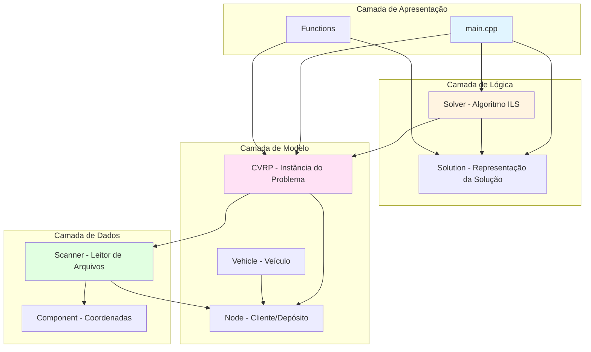
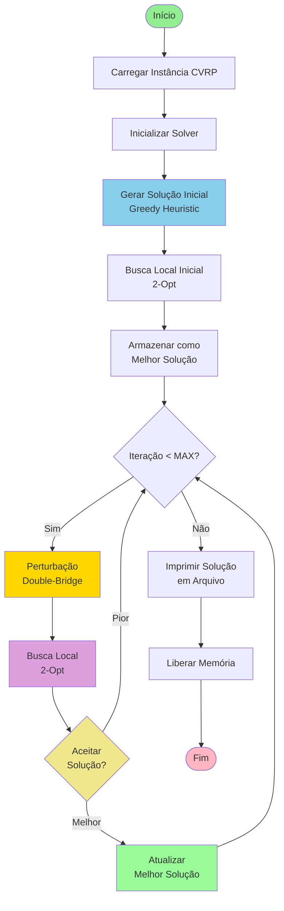
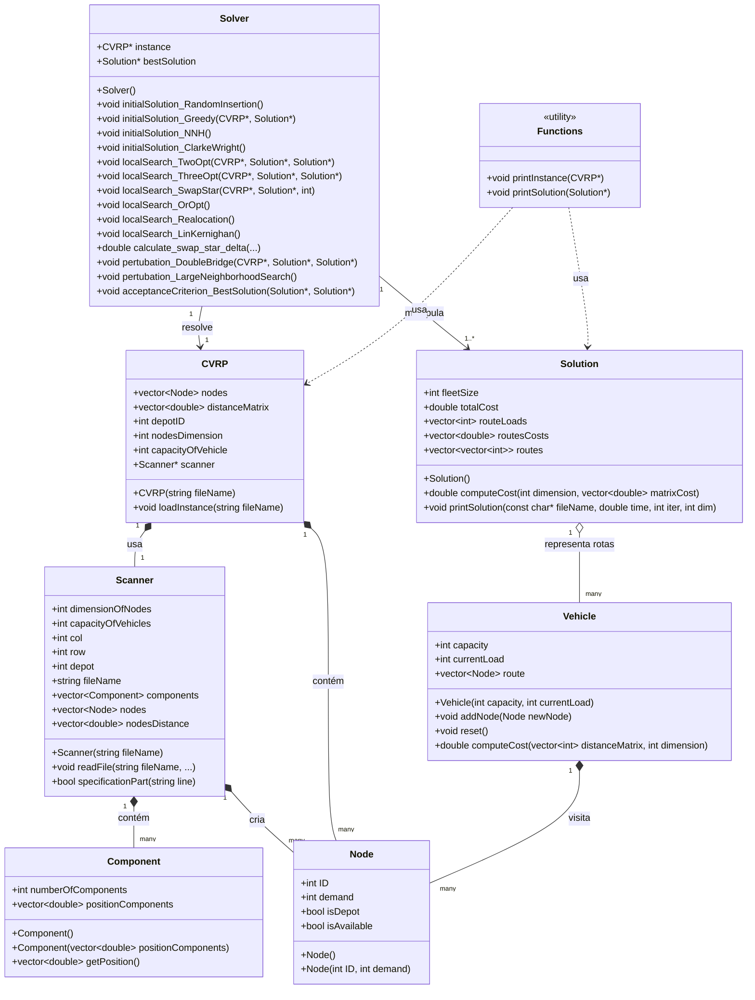
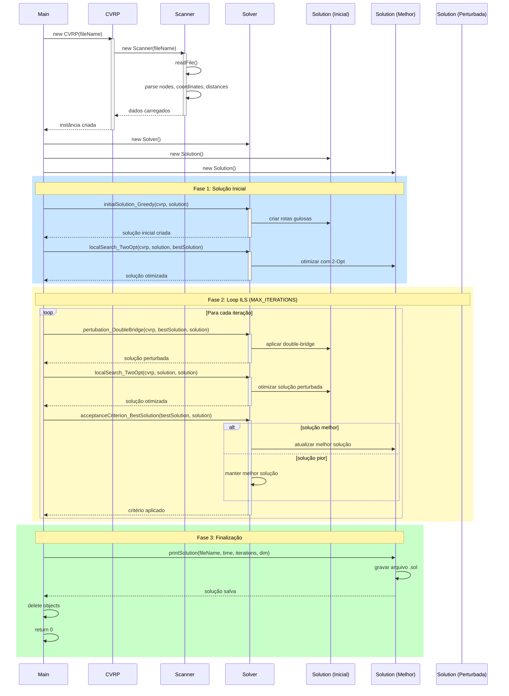
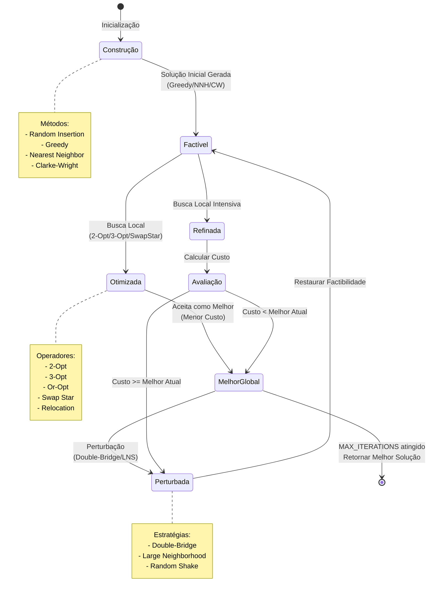
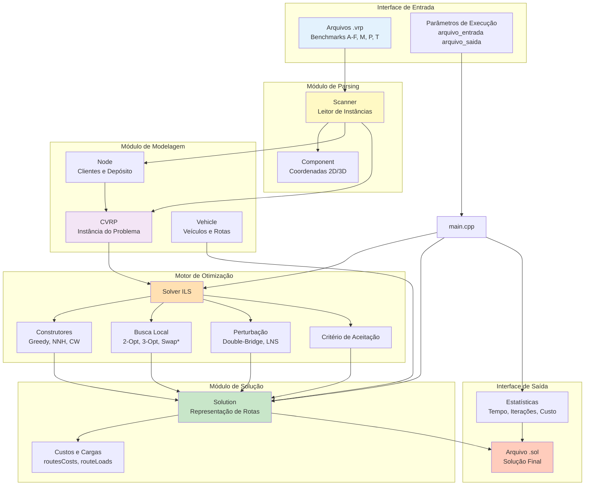
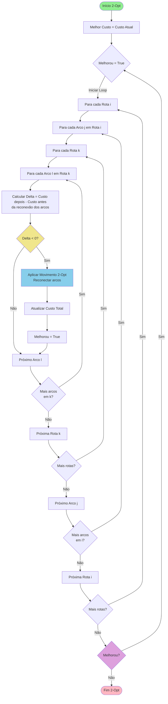

# 🚛 Capacitated Vehicle Routing Problem (CVRP)
## 🚩 Iterated Local Search (ILS) Implementation

[](https://isocpp.org/)
[](LICENSE)
[](Makefile)

Este repositório contém uma implementação eficiente do algoritmo **Iterated Local Search (ILS)** para resolver o **Capacitated Vehicle Routing Problem (CVRP)**, um problema clássico de otimização combinatória que busca determinar rotas ótimas para uma frota de veículos com capacidade limitada, atendendo às demandas de múltiplos clientes.

---

## 📋 Índice
- [Características](#-características)
- [Arquitetura do Sistema](#-arquitetura-do-sistema)
- [Estrutura do Projeto](#-estrutura-do-projeto)
- [Algoritmo ILS](#-algoritmo-ils)
- [Diagramas Técnicos](#-diagramas-técnicos)
- [Compilação e Execução](#-compilação-e-execução)
- [Exemplos de Uso](#-exemplos-de-uso)
- [Benchmark e Resultados](#-benchmark-e-resultados)
- [Contribuições](#-contribuições)

---

## ✨ Características

### Algoritmos Implementados

#### 🎯 Soluções Iniciais
- **Random Insertion**: Inserção aleatória de clientes nas rotas
- **Greedy Heuristic**: Construção gulosa priorizando menor custo
- **Nearest Neighbor Heuristic (NNH)**: Vizinho mais próximo
- **Clarke-Wright Savings**: Algoritmo de economia de Clarke-Wright

#### 🔍 Busca Local
- **2-Opt**: Otimização de rotas através de reconexões de arcos
- **3-Opt**: Extensão do 2-opt com três pontos de quebra
- **Swap Star**: Troca de sequências de clientes entre rotas
- **Or-Opt**: Relocação de sequências de clientes
- **Relocation**: Realocação de clientes individuais
- **Lin-Kernighan**: Heurística avançada de busca local

#### 🔄 Perturbação
- **Double-Bridge**: Perturbação estrutural da solução
- **Large Neighborhood Search**: Busca em vizinhança ampla

#### ✅ Critério de Aceitação
- **Best Solution**: Aceita apenas soluções que melhoram o custo total

---

## 🏛 Arquitetura do Sistema

O sistema é organizado em camadas bem definidas, seguindo princípios de design orientado a objetos:


```mermaid
graph TB
    subgraph "Camada de Apresentação"
        Main[main.cpp]
        Functions[Functions]
    end

    subgraph "Camada de Lógica"
        Solver[Solver - Algoritmo ILS]
        Solution[Solution - Representação da Solução]
    end

    subgraph "Camada de Modelo"
        CVRP[CVRP - Instância do Problema]
        Vehicle[Vehicle - Veículo]
        Node[Node - Cliente/Depósito]
    end

    subgraph "Camada de Dados"
        Scanner[Scanner - Leitor de Arquivos]
        Component[Component - Coordenadas]
    end

    Main --> Solver
    Main --> CVRP
    Main --> Solution
    Solver --> Solution
    Solver --> CVRP
    CVRP --> Scanner
    CVRP --> Node
    Scanner --> Component
    Scanner --> Node
    Vehicle --> Node
    Functions --> CVRP
    Functions --> Solution

    style Main fill:#e1f5ff
    style Solver fill:#fff4e1
    style CVRP fill:#ffe1f5
    style Scanner fill:#e1ffe1
```

---

## 📁 Estrutura do Projeto

```
CapacitatedVehicleRoutingProblem-ILS/
├── 📂 Benchmarks/          # Instâncias de teste (formato .vrp)
│   ├── A/                  # Conjunto A (Augerat et al.)
│   ├── B/                  # Conjunto B (Augerat et al.)
│   ├── E/                  # Conjunto E (Christofides & Eilon)
│   ├── F/                  # Conjunto F (Fisher)
│   ├── M/                  # Conjunto M (Christofides, Mingozzi & Toth)
│   ├── P/                  # Conjunto P (Christofides & Eilon)
│   └── T/                  # Conjunto T (Teste pequeno)
├── 📂 src/                 # Código-fonte C++
│   ├── Component.h/cpp     # Representação de coordenadas
│   ├── CVRP.h/cpp          # Classe principal do problema
│   ├── Functions.h/cpp     # Funções utilitárias
│   ├── Node.h/cpp          # Representação de nó (cliente/depósito)
│   ├── Scanner.h/cpp       # Leitor de arquivos .vrp
│   ├── Solution.h/cpp      # Estrutura de solução
│   ├── Solver.h/cpp        # Implementação do ILS
│   ├── Vehicle.h/cpp       # Representação de veículo
│   ├── main.cpp            # Ponto de entrada principal
│   └── main_exe.cpp        # Executável alternativo
├── 📂 Output/              # Soluções geradas (.sol)
├── 📂 bin/                 # Binários compilados
├── 📄 Makefile             # Sistema de compilação
└── 📄 README.md            # Documentação

```

---

## 🔄 Algoritmo ILS

### Visão Geral do Fluxo

O Iterated Local Search é um metaheurística que alterna entre intensificação (busca local) e diversificação (perturbação) para explorar eficientemente o espaço de soluções.


```mermaid
flowchart TD
    Start([Início]) --> LoadInstance[Carregar Instância CVRP]
    LoadInstance --> InitSolver[Inicializar Solver]

    InitSolver --> GenInitial[Gerar Solução Inicial<br/>Greedy Heuristic]

    GenInitial --> FirstLS[Busca Local Inicial<br/>2-Opt]
    FirstLS --> StoreBest[Armazenar como<br/>Melhor Solução]

    StoreBest --> IterLoop{Iteração < MAX?}

    IterLoop -->|Sim| Perturb[Perturbação<br/>Double-Bridge]
    Perturb --> LocalSearch[Busca Local<br/>2-Opt]
    LocalSearch --> Accept{Aceitar<br/>Solução?}

    Accept -->|Melhor| UpdateBest[Atualizar<br/>Melhor Solução]
    Accept -->|Pior| IterLoop
    UpdateBest --> IterLoop

    IterLoop -->|Não| PrintSol[Imprimir Solução<br/>em Arquivo]
    PrintSol --> Cleanup[Liberar Memória]
    Cleanup --> End([Fim])

    style Start fill:#90EE90
    style End fill:#FFB6C1
    style GenInitial fill:#87CEEB
    style Perturb fill:#FFD700
    style LocalSearch fill:#DDA0DD
    style Accept fill:#F0E68C
    style UpdateBest fill:#98FB98
```

### Pseudocódigo Detalhado

```
Algoritmo ILS-CVRP(instância, max_iterações)
│
├─ Entrada: instância CVRP, max_iterações
├─ Saída: melhor_solução encontrada
│
├─ solução ← GerarSoluçãoInicial(instância)        // Greedy
├─ solução ← BuscaLocal(solução)                   // 2-Opt
├─ melhor_solução ← solução
│
├─ Para i ← 1 até max_iterações faça:
│  │
│  ├─ nova_solução ← Perturbação(melhor_solução)   // Double-Bridge
│  ├─ nova_solução ← BuscaLocal(nova_solução)      // 2-Opt
│  │
│  ├─ Se Custo(nova_solução) < Custo(melhor_solução) então:
│  │  └─ melhor_solução ← nova_solução
│  │
│  └─ Fim Se
│
├─ Retornar melhor_solução
```

---

## 📊 Diagramas Técnicos

### 1. Diagrama de Classes Completo


```mermaid
classDiagram
    class Node {
        +int ID
        +int demand
        +bool isDepot
        +bool isAvailable
        +Node()
        +Node(int ID, int demand)
    }

    class Component {
        +int numberOfComponents
        +vector~double~ positionComponents
        +Component()
        +Component(vector~double~ positionComponents)
        +vector~double~ getPosition()
    }

    class Scanner {
        +int dimensionOfNodes
        +int capacityOfVehicles
        +int col
        +int row
        +int depot
        +string fileName
        +vector~Component~ components
        +vector~Node~ nodes
        +vector~double~ nodesDistance
        +Scanner(string fileName)
        +void readFile(string fileName, ...)
        +bool specificationPart(string line)
    }

    class CVRP {
        +vector~Node~ nodes
        +vector~double~ distanceMatrix
        +int depotID
        +int nodesDimension
        +int capacityOfVehicle
        +Scanner* scanner
        +CVRP(string fileName)
        +void loadInstance(string fileName)
    }

    class Vehicle {
        +int capacity
        +int currentLoad
        +vector~Node~ route
        +Vehicle(int capacity, int currentLoad)
        +void addNode(Node newNode)
        +void reset()
        +double computeCost(vector~int~ distanceMatrix, int dimension)
    }

    class Solution {
        +int fleetSize
        +double totalCost
        +vector~int~ routeLoads
        +vector~double~ routesCosts
        +vector~vector~int~~ routes
        +Solution()
        +double computeCost(int dimension, vector~double~ matrixCost)
        +void printSolution(const char* fileName, double time, int iter, int dim)
    }

    class Solver {
        +CVRP* instance
        +Solution* bestSolution
        +Solver()
        +void initialSolution_RandomInsertion()
        +void initialSolution_Greedy(CVRP*, Solution*)
        +void initialSolution_NNH()
        +void initialSolution_ClarkeWright()
        +void localSearch_TwoOpt(CVRP*, Solution*, Solution*)
        +void localSearch_ThreeOpt(CVRP*, Solution*, Solution*)
        +void localSearch_SwapStar(CVRP*, Solution*, int)
        +void localSearch_OrOpt()
        +void localSearch_Realocation()
        +void localSearch_LinKernighan()
        +double calculate_swap_star_delta(...)
        +void pertubation_DoubleBridge(CVRP*, Solution*, Solution*)
        +void pertubation_LargeNeighborhoodSearch()
        +void acceptanceCriterion_BestSolution(Solution*, Solution*)
    }

    class Functions {
        <<utility>>
        +void printInstance(CVRP*)
        +void printSolution(Solution*)
    }

    Scanner "1" *-- "many" Component : contém
    Scanner "1" *-- "many" Node : cria
    CVRP "1" *-- "1" Scanner : usa
    CVRP "1" *-- "many" Node : contém
    Vehicle "1" *-- "many" Node : visita
    Solution "1" o-- "many" Vehicle : representa rotas
    Solver "1" --> "1" CVRP : resolve
    Solver "1" --> "1..*" Solution : manipula
    Functions ..> CVRP : usa
    Functions ..> Solution : usa
```

### 2. Diagrama de Sequência - Fluxo Principal


```mermaid
sequenceDiagram
    participant Main
    participant CVRP
    participant Scanner
    participant Solver
    participant Solution as Solution (Inicial)
    participant BestSol as Solution (Melhor)
    participant PertSol as Solution (Perturbada)

    Main->>CVRP: new CVRP(fileName)
    activate CVRP
    CVRP->>Scanner: new Scanner(fileName)
    activate Scanner
    Scanner->>Scanner: readFile()
    Scanner->>Scanner: parse nodes, coordinates, distances
    Scanner-->>CVRP: dados carregados
    deactivate Scanner
    CVRP-->>Main: instância criada
    deactivate CVRP

    Main->>Solver: new Solver()
    Main->>Solution: new Solution()
    Main->>BestSol: new Solution()

    rect rgb(200, 230, 255)
        Note over Main,BestSol: Fase 1: Solução Inicial
        Main->>Solver: initialSolution_Greedy(cvrp, solution)
        activate Solver
        Solver->>Solution: criar rotas gulosas
        Solver-->>Main: solução inicial criada
        deactivate Solver

        Main->>Solver: localSearch_TwoOpt(cvrp, solution, bestSolution)
        activate Solver
        Solver->>BestSol: otimizar com 2-Opt
        Solver-->>Main: solução otimizada
        deactivate Solver
    end

    rect rgb(255, 250, 200)
        Note over Main,PertSol: Fase 2: Loop ILS (MAX_ITERATIONS)
        loop Para cada iteração
            Main->>Solver: pertubation_DoubleBridge(cvrp, bestSolution, solution)
            activate Solver
            Solver->>Solution: aplicar double-bridge
            Solver-->>Main: solução perturbada
            deactivate Solver

            Main->>Solver: localSearch_TwoOpt(cvrp, solution, solution)
            activate Solver
            Solver->>Solution: otimizar solução perturbada
            Solver-->>Main: solução otimizada
            deactivate Solver

            Main->>Solver: acceptanceCriterion_BestSolution(bestSolution, solution)
            activate Solver
            alt solução melhor
                Solver->>BestSol: atualizar melhor solução
            else solução pior
                Solver->>Solver: manter melhor solução
            end
            Solver-->>Main: critério aplicado
            deactivate Solver
        end
    end

    rect rgb(200, 255, 200)
        Note over Main,BestSol: Fase 3: Finalização
        Main->>BestSol: printSolution(fileName, time, iterations, dim)
        BestSol->>BestSol: gravar arquivo .sol
        BestSol-->>Main: solução salva

        Main->>Main: delete objects
        Main->>Main: return 0
    end
```

### 3. Diagrama de Estados da Solução


```mermaid
stateDiagram-v2
    [*] --> Construção: Inicialização

    Construção --> Factível: Solução Inicial Gerada<br/>(Greedy/NNH/CW)

    Factível --> Otimizada: Busca Local<br/>(2-Opt/3-Opt/SwapStar)

    Otimizada --> MelhorGlobal: Aceita como Melhor<br/>(Menor Custo)

    MelhorGlobal --> Perturbada: Perturbação<br/>(Double-Bridge/LNS)

    Perturbada --> Factível: Restaurar Factibilidade

    Factível --> Refinada: Busca Local Intensiva

    Refinada --> Avaliação: Calcular Custo

    Avaliação --> MelhorGlobal: Custo < Melhor Atual
    Avaliação --> Perturbada: Custo >= Melhor Atual

    MelhorGlobal --> [*]: MAX_ITERATIONS atingido<br/>Retornar Melhor Solução

    note right of Construção
        Métodos:
        - Random Insertion
        - Greedy
        - Nearest Neighbor
        - Clarke-Wright
    end note

    note right of Otimizada
        Operadores:
        - 2-Opt
        - 3-Opt
        - Or-Opt
        - Swap Star
        - Relocation
    end note

    note right of Perturbada
        Estratégias:
        - Double-Bridge
        - Large Neighborhood
        - Random Shake
    end note
```

### 4. Diagrama de Componentes do Sistema


```mermaid
graph TB
    subgraph "Interface de Entrada"
        BenchFiles[Arquivos .vrp<br/>Benchmarks A-F, M, P, T]
        InputParams[Parâmetros de Execução<br/>arquivo_entrada arquivo_saida]
    end

    subgraph "Módulo de Parsing"
        Scanner[Scanner<br/>Leitor de Instâncias]
        Component[Component<br/>Coordenadas 2D/3D]
    end

    subgraph "Módulo de Modelagem"
        CVRP[CVRP<br/>Instância do Problema]
        Node[Node<br/>Clientes e Depósito]
        Vehicle[Vehicle<br/>Veículos e Rotas]
    end

    subgraph "Módulo de Solução"
        Solution[Solution<br/>Representação de Rotas]
        Costs[Custos e Cargas<br/>routesCosts, routeLoads]
    end

    subgraph "Motor de Otimização"
        Solver[Solver ILS]
        InitialSol[Construtores<br/>Greedy, NNH, CW]
        LocalSrch[Busca Local<br/>2-Opt, 3-Opt, Swap*]
        Perturb[Perturbação<br/>Double-Bridge, LNS]
        Accept[Critério de Aceitação]
    end

    subgraph "Interface de Saída"
        OutputFile[Arquivo .sol<br/>Solução Final]
        Stats[Estatísticas<br/>Tempo, Iterações, Custo]
    end

    BenchFiles --> Scanner
    InputParams --> Main[main.cpp]
    Scanner --> Component
    Scanner --> Node
    Scanner --> CVRP

    CVRP --> Solver
    Node --> CVRP
    Vehicle --> Solution

    Main --> Solver
    Main --> Solution

    Solver --> InitialSol
    Solver --> LocalSrch
    Solver --> Perturb
    Solver --> Accept

    InitialSol --> Solution
    LocalSrch --> Solution
    Perturb --> Solution
    Accept --> Solution

    Solution --> Costs
    Solution --> OutputFile
    Main --> Stats
    Stats --> OutputFile

    style BenchFiles fill:#E3F2FD
    style Scanner fill:#FFF9C4
    style CVRP fill:#F3E5F5
    style Solver fill:#FFE0B2
    style Solution fill:#C8E6C9
    style OutputFile fill:#FFCCBC
```

### 5. Diagrama de Atividades - Busca Local 2-Opt


```mermaid
flowchart TD
    Start([Início 2-Opt]) --> InitBest[Melhor Custo = Custo Atual]
    InitBest --> Improved{Melhorou = True}

    Improved -->|Iniciar Loop| ForRoute1[Para cada Rota i]
    ForRoute1 --> ForEdge1[Para cada Arco j em Rota i]

    ForEdge1 --> ForRoute2[Para cada Rota k]
    ForRoute2 --> ForEdge2[Para cada Arco l em Rota k]

    ForEdge2 --> CalcDelta[Calcular Delta = Custo depois - Custo antes<br/>da reconexão dos arcos]

    CalcDelta --> CheckDelta{Delta < 0?}
    CheckDelta -->|Sim| Apply2Opt[Aplicar Movimento 2-Opt<br/>Reconectar arcos]
    CheckDelta -->|Não| NextEdge2

    Apply2Opt --> UpdateCost[Atualizar Custo Total]
    UpdateCost --> SetImproved[Melhorou = True]
    SetImproved --> NextEdge2[Próximo Arco l]

    NextEdge2 --> CheckEdge2{Mais arcos<br/>em k?}
    CheckEdge2 -->|Sim| ForEdge2
    CheckEdge2 -->|Não| NextRoute2[Próxima Rota k]

    NextRoute2 --> CheckRoute2{Mais rotas?}
    CheckRoute2 -->|Sim| ForRoute2
    CheckRoute2 -->|Não| NextEdge1[Próximo Arco j]

    NextEdge1 --> CheckEdge1{Mais arcos<br/>em i?}
    CheckEdge1 -->|Sim| ForEdge1
    CheckEdge1 -->|Não| NextRoute1[Próxima Rota i]

    NextRoute1 --> CheckRoute1{Mais rotas?}
    CheckRoute1 -->|Sim| ForRoute1
    CheckRoute1 -->|Não| CheckImproved{Melhorou?}

    CheckImproved -->|Sim| Improved
    CheckImproved -->|Não| End([Fim 2-Opt])

    style Start fill:#90EE90
    style End fill:#FFB6C1
    style Apply2Opt fill:#87CEEB
    style CheckDelta fill:#F0E68C
    style CheckImproved fill:#DDA0DD
```

---

## 🛠 Compilação e Execução

### Requisitos
- **Compilador**: G++ com suporte a C++17 ou superior
- **Make**: Sistema GNU Make
- **Sistema Operacional**: Linux, macOS ou WSL (Windows)
- **Memória**: Mínimo 512 MB RAM
- **Valgrind** (opcional): Para análise de memória

### Compilação

```bash
# Compilar o projeto
make

# Ou compilar com flags específicas
make CXX=g++ CXXFLAGS="-std=c++17 -O3 -Wall"

# Limpar binários
make clean
```

### Estrutura de Diretórios após Compilação

```
bin/
└── cvrp_solver        # Executável principal
```

---

## 🎯 Exemplos de Uso

### Uso Básico

```bash
# Sintaxe
./bin/cvrp_solver <arquivo_entrada.vrp> <arquivo_saida.sol>

# Executar instância pequena
./bin/cvrp_solver Benchmarks/T/T-n5-k5.vrp Output/T/T-n5-k5.sol

# Executar instância média
./bin/cvrp_solver Benchmarks/A/A-n32-k5.vrp Output/A/A-n32-k5.sol

# Executar instância grande
./bin/cvrp_solver Benchmarks/E/E-n101-k14.vrp Output/E/E-n101-k14.sol
```

### Análise com Valgrind

```bash
# Verificar vazamentos de memória
valgrind --leak-check=full \
         --show-leak-kinds=all \
         --track-origins=yes \
         --verbose \
         --log-file=valgrind-out.txt \
         ./bin/cvrp_solver Benchmarks/A/A-n32-k5.vrp Output/A/A-n32-k5.sol

# Análise rápida
valgrind --leak-check=yes -s \
         ./bin/cvrp_solver Benchmarks/T/T-n5-k5.vrp Output/T/T-n5-k5.sol
```

### Execução em Lote

```bash
# Processar múltiplas instâncias
for file in Benchmarks/A/*.vrp; do
    base=$(basename "$file" .vrp)
    ./bin/cvrp_solver "$file" "Output/A/${base}.sol"
done
```

### Formato de Saída (.sol)

```
=== CVRP Solution ===
Instance: A-n32-k5.vrp
Nodes: 32
Fleet Size: 5
Total Cost: 784.00
Execution Time: 2.345 seconds
Iterations: 1000

Route 1: 0 -> 21 -> 31 -> 19 -> 17 -> 0 (Cost: 156.78, Load: 98/100)
Route 2: 0 -> 12 -> 3 -> 26 -> 8 -> 0 (Cost: 187.23, Load: 100/100)
Route 3: 0 -> 28 -> 4 -> 13 -> 0 (Cost: 143.56, Load: 87/100)
Route 4: 0 -> 18 -> 7 -> 30 -> 20 -> 0 (Cost: 167.89, Load: 95/100)
Route 5: 0 -> 5 -> 15 -> 29 -> 0 (Cost: 128.54, Load: 76/100)
```

---

## 📊 Benchmark e Resultados

### Conjuntos de Instâncias Disponíveis

| Conjunto | Origem | Nós | Veículos | Dificuldade |
|----------|--------|-----|----------|-------------|
| **A-n32-k5** | Augerat et al. | 32 | 5 | ⭐⭐ |
| **B-n50-k8** | Augerat et al. | 50 | 8 | ⭐⭐⭐ |
| **E-n101-k14** | Christofides & Eilon | 101 | 14 | ⭐⭐⭐⭐ |
| **F-n72-k4** | Fisher | 72 | 4 | ⭐⭐⭐⭐ |
| **M-n151-k12** | Christofides, Mingozzi & Toth | 151 | 12 | ⭐⭐⭐⭐⭐ |
| **P-n55-k15** | Christofides & Eilon | 55 | 15 | ⭐⭐⭐ |
| **T-n5-k5** | Teste | 5 | 5 | ⭐ (Didático) |

### Parâmetros do Algoritmo

No arquivo `main.cpp`:

```cpp
#define MAX_ITERATIONS 1000  // Número de iterações do ILS
```

**Ajustes Recomendados**:
- Instâncias pequenas (< 50 nós): 500-1000 iterações
- Instâncias médias (50-100 nós): 1000-2000 iterações
- Instâncias grandes (> 100 nós): 2000-5000 iterações

### Complexidade Computacional

| Operação | Complexidade | Descrição |
|----------|--------------|-----------|
| Greedy Constructive | O(n²) | Construção da solução inicial |
| 2-Opt (uma iteração) | O(n²) | Por rota |
| 3-Opt (uma iteração) | O(n³) | Por rota |
| Swap Star | O(n² × k) | k = tamanho da cadeia |
| Double-Bridge | O(n) | Perturbação |
| ILS Completo | O(I × n²) | I = iterações |

---

## 🧪 Casos de Uso

### 1. **Pesquisa Acadêmica**
Ideal para:
- Estudar metaheurísticas ILS
- Comparar diferentes operadores de busca local
- Analisar estratégias de perturbação
- Desenvolver novos algoritmos baseados em ILS

### 2. **Logística e Distribuição**
Aplicável em:
- Roteirização de entregas urbanas
- Planejamento de coleta de resíduos
- Distribuição de produtos perecíveis
- Otimização de frotas comerciais

### 3. **Ensino de Otimização**
Utilize para:
- Demonstrar conceitos de programação em C++
- Ensinar algoritmos de busca local
- Ilustrar trade-offs entre intensificação e diversificação
- Mostrar aplicações práticas de grafos

---

## 🔬 Extensões Possíveis

### Melhorias Algorítmicas
- [ ] Implementar **Simulated Annealing** como critério de aceitação
- [ ] Adicionar **Algoritmo Genético** para comparação
- [ ] Implementar **Variable Neighborhood Search (VNS)**
- [ ] Adicionar **Adaptive Large Neighborhood Search (ALNS)**
- [ ] Paralelizar busca local com **OpenMP**

### Funcionalidades Adicionais
- [ ] Suporte a **janelas de tempo** (CVRPTW)
- [ ] Suporte a **múltiplos depósitos** (MDCVRP)
- [ ] Visualização gráfica das rotas (Python/Matplotlib)
- [ ] Interface web interativa
- [ ] API REST para integração

### Otimizações de Código
- [ ] Cache de distâncias para acelerar cálculos
- [ ] Estruturas de dados mais eficientes (Delta Heap)
- [ ] Compilação com otimizações AVX/SSE
- [ ] Profiling e otimização de hotspots

---

## 📚 Referências

1. **Lourenço, H. R., Martin, O. C., & Stützle, T.** (2003). *Iterated local search.* In Handbook of metaheuristics (pp. 320-353). Springer.

2. **Toth, P., & Vigo, D.** (2014). *Vehicle routing: problems, methods, and applications.* Society for Industrial and Applied Mathematics.

3. **Clarke, G., & Wright, J. W.** (1964). *Scheduling of vehicles from a central depot to a number of delivery points.* Operations research, 12(4), 568-581.

4. **Lin, S., & Kernighan, B. W.** (1973). *An effective heuristic algorithm for the traveling-salesman problem.* Operations research, 21(2), 498-516.

5. **Augerat, P., Belenguer, J. M., Benavent, E., Corberán, A., Naddef, D., & Rinaldi, G.** (1995). *Computational results with a branch and cut code for the capacitated vehicle routing problem.* Research Report, ARTEMIS-IMAG.

---

## 🤝 Contribuições

Contribuições são muito bem-vindas! Para contribuir:

1. **Fork** este repositório
2. Crie uma **branch** para sua feature (`git checkout -b feature/NovaFuncionalidade`)
3. **Commit** suas mudanças (`git commit -m 'Add: Nova funcionalidade X'`)
4. **Push** para a branch (`git push origin feature/NovaFuncionalidade`)
5. Abra um **Pull Request**

### Diretrizes de Contribuição
- Siga o estilo de código existente
- Adicione comentários em código complexo
- Teste suas mudanças antes de submeter
- Atualize a documentação se necessário
- Use mensagens de commit descritivas

---

## 📄 Licença

Este projeto está licenciado sob a **MIT License** - veja o arquivo [LICENSE](LICENSE) para detalhes.

---

## 👤 Autor

**Isaac Kosloski**
- GitHub: [@IsaacKosloski](https://github.com/IsaacKosloski)

---

## ⭐ Agradecimentos

Agradeço à comunidade de otimização combinatória e aos pesquisadores que disponibilizaram as instâncias de benchmark públicas, tornando possível a validação e comparação de algoritmos.

---

<div align="center">

**Se este projeto foi útil, considere dar uma ⭐!**

Desenvolvido com 💙 por Isaac Kosloski

</div>
